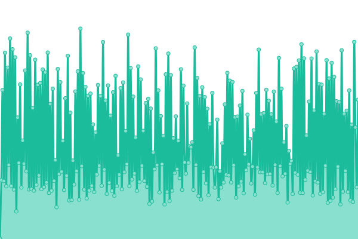

# [📈 Live Status](https://status.poclanos.cord.town): <!--live status--> **🟩 All systems operational**

This repository contains the open-source uptime monitor and status page for [포크라노스](https://poclanos.com/), powered by [Upptime](https://github.com/upptime/upptime).

With [Upptime](https://upptime.js.org), you can get your own unlimited and free uptime monitor and status page, powered entirely by a GitHub repository. We use [Issues](https://github.com/POCLANOS/status/issues) as incident reports, [Actions](https://github.com/POCLANOS/status/actions) as uptime monitors, and [Pages](https://status.poclanos.cord.town) for the status page.

<!--start: status pages-->
<!-- This summary is generated by Upptime (https://github.com/upptime/upptime) -->
<!-- Do not edit this manually, your changes will be overwritten -->
<!-- prettier-ignore -->
| URL | Status | History | Response Time | Uptime |
| --- | ------ | ------- | ------------- | ------ |
|  [POCLANOS](https://poclanos.com/) | 🟩 Up | [poclanos.yml](https://github.com/POCLANOS/status/commits/HEAD/history/poclanos.yml) | 

 1440ms
     
 | 

<a href="https://status.poclanos.cord.town/history/poclanos">99.81%</a>
    

|  [MAGIC STRAWBERRY SOUND](https://www.msbsound.com/) | 🟩 Up | [magic-strawberry-sound.yml](https://github.com/POCLANOS/status/commits/HEAD/history/magic-strawberry-sound.yml) | 

 2364ms
     
 | 

<a href="https://status.poclanos.cord.town/history/magic-strawberry-sound">100.00%</a>
    

|  [OZZ](https://www.oz-z.com/) | 🟩 Up | [ozz.yml](https://github.com/POCLANOS/status/commits/HEAD/history/ozz.yml) | 

 1230ms
     
 | 

<a href="https://status.poclanos.cord.town/history/ozz">100.00%</a>
    

|  [MUSA](https://storemusa.com/) | 🟩 Up | [musa.yml](https://github.com/POCLANOS/status/commits/HEAD/history/musa.yml) | 

 764ms
     
 | 

<a href="https://status.poclanos.cord.town/history/musa">70.78%</a>
    

|  [MOUND MEDIA](https://moundmedia.co.kr/) | 🟩 Up | [mound-media.yml](https://github.com/POCLANOS/status/commits/HEAD/history/mound-media.yml) | 

 1252ms
     
 | 

<a href="https://status.poclanos.cord.town/history/mound-media">100.00%</a>
    

<!--end: status pages-->

[**Visit our status website →**](https://status.poclanos.cord.town)

## 📄 License

- Powered by: [Upptime](https://github.com/upptime/upptime)
- Code: [MIT](./LICENSE) © [포크라노스](https://poclanos.com/)
- Data in the `./history` directory: [Open Database License](https://opendatacommons.org/licenses/odbl/1-0/)
